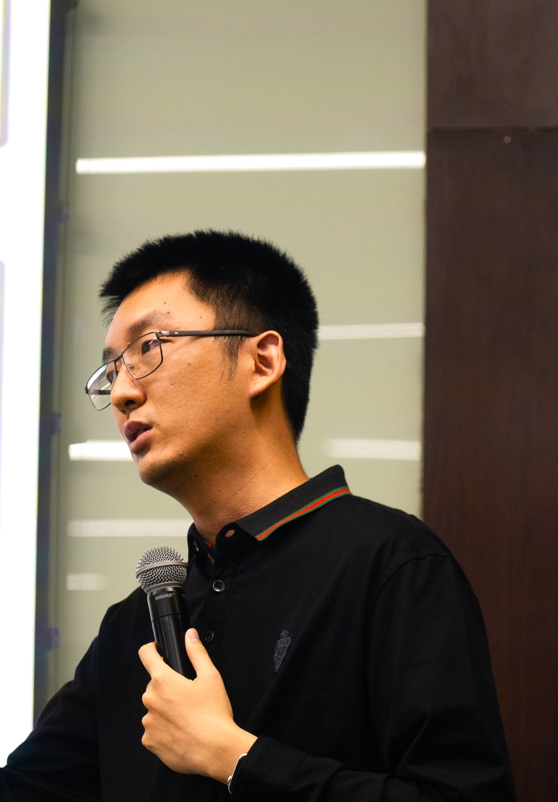

朱恬骅 Tianhua Zhu
==================

上海社会科学院文学研究所助理研究员 Assistant Research Faculty at Institute of Literature, Shanghai Academy of Social Sciences

E-mail: thzhu15 \[at\] fudan.edu.cn

## 研究方向 Resarch Interests

- 计算机艺术与美学 Computer Art & Aesthetics
- 科学技术哲学 Philosophy of Science and Technology

主要聚焦计算机技术与文学艺术的交叉领域，探究新技术如何成为艺术表达的手段，并对艺术形式产生新的影响。近期的研究重点为人工智能文艺，认为人工智能模型本身可以成为一种潜在的艺术表达形式，并以技术设计者、使用者同相关作品的创作者之间建立合作关系为前提。在梳理把握计算机艺术的历史实践和当代发展的基础上，对计算机艺术的主题式界定，论述了这种“计算机艺术”的基本属性、物质基础和观念渊源，为进一步探究其中突显的文艺美学基本问题提供了概念工具。

## 发表论文 Publications

1. 朱恬骅：《从可解释性悖论到计算性诗学：人工智能文本生成的解释策略》，《求索》2025年第3期，第96—104页
1. 黄劲草、朱恬骅：《培育“人工智能观”：教学实践与有效性依据》，《数字人文》2025年第1期，第35—51页
1. 朱恬骅：《制造诗歌机器：文本生成的诗学》，《文艺论坛》2024年第6期，第67—74页
1. 朱恬骅：《出版的可能未来：技术装置再生产中的电子游戏》，《现代出版》2024年第11期，第47—54页
1. 朱恬骅：《图像媒介与颜色理论的历史生成：摄影术、水彩与数字图像》，《北京电影学院学报》2024年第9期，第14—25页
1. 朱恬骅：《人工智能影像生成的模型诗学》，《电影艺术》2024年第5期，第28—34页
1. 朱恬骅：《言语行为、文学书写与装置编程：城市漫步的三种模式》，《中国图书评论》2024年第8期，第21—30页
1. 朱恬骅：《人工智能会创作吗？——“类文学文本”生成的创造力疑难与集体性方案》，《南京社会科学》2024年第7期，第113—121页
1. 朱恬骅：《“另类”与“日常”：城市更新中的艺术空间》，《上海文化》2024年第4期，第81-88+101页
1. 朱恬骅：《AIGC“何时为艺术”——从形态相似性到艺术条件》，《艺术学研究》2023年第3期，第76—88页
1. 朱恬骅：《“算法”提喻的话语陷阱》，《中国图书评论》No.383第1期，2023年，第10—17页
1. 朱恬骅：《走向隐喻的“元宇宙”：数字制品的价值兑现》，《中国图书评论》No.382第12期，2022年，第18—30页
1. Tianhua Zhu, “From Textual Experiments to Experimental Texts: Expressive Repetition in ‘Artificial Intelligence Literature,’” _SASS Studies_, no. 23 (Winter 2021), pp. 124-142.
1. 朱恬骅：《NFT交易的兴起与数字艺术的价值依据》，《上海文化》2022年第8期，第89—94页
1. 朱恬骅：《重审技术分析：计算机图像的意义生成与艺术潜能》，《艺术学研究》2022年第3期，第132—142页
1. 朱恬骅：《从文本实验到实验文本：“人工智能文学”的表达性重复》，《社会科学文摘》No.73第1期，2022年，第112—114页
1. 陈云霞、朱恬骅：《上海郊野景观中的江南文化系统——以〈上海乡村漫步〉和〈佘山小志〉为例》，《全球城市研究（中英文）》第2卷第3期，2021年，第149-159+193页
1. 朱恬骅：《从文本实验到实验文本：“人工智能文学”的表达性重复》，《文艺理论研究》第41卷第5期，2021年9月，第131—140页
1. 刘楠、朱恬骅、葛致远：《在线科普活动的参与水平与影响因素分析——基于新型冠状病毒科普知识有奖竞答的考察》，《教育传播与技术》2021年第3期，第77-82+88页
1. 狄霞晨、朱恬骅：《严复与中国文学观念的现代转型》，《社会科学文摘》2021年第3期，第106—108页
1. 朱恬骅：《技术主张的文化响应模式——以法、苏报刊中的控制论论争为中心（1950-1960）》，《自然辩证法研究》第37卷第4期，2021年4月，第61—66页
1. 朱恬骅：《作为美学问题域的计算机艺术》，《上海文化》2020年第12期，第31—41页
1. 狄霞晨、朱恬骅：《严复与中国文学观念的现代转型》，《复旦学报（社会科学版）》第63卷第1期，2021年1月，第26—36页
1. Tianhua Zhu, “Defining Computer Art: Methods, Themes, and the Aesthetic Problematic,” _China in Culture_ (Canada), vol. 1, no. 4 (December 2020), pp. 149-159.
1. 朱恬骅：《西蒙栋“技术美学”评析》，《自然辩证法研究》第34卷第5期，2018年，第37—42页
1. 朱恬骅：《论九鬼周造基于偶然性的艺术观》，《理论界》2016年第10期，第98—103页
1. 朱恬骅：《民俗学史视角下沈从文的创作与研究:1926-1949》，《文艺评论》2016年第10期，第1—8页
1. 朱恬骅：《王韬《漫游随录》中域外城市的文本编码和图像表达》，《上海文化》2014年第10期，第56—63页
1. 朱恬骅：《晚清科学小说中技术想象的来源与意义探析  以“电”和“化学”为例》，《科学文化评论》2014年第4 vo 11期，第63—76页

## 专著 Monograph

1. 朱恬骅：《计算机艺术的形态发生》，上海：上海科学技术出版社，2024年
  - 郑元者：[序言](https://www.sohu.com/a/754401924_121856459)
  - [结论试读：计算机艺术的未来与未来艺术](https://wxs.sass.org.cn/2024/0718/c6913a572525/page.htm)
  - [《上海文化》2025年6月介绍](https://kns.cnki.net/kcms2/article/abstract?v=IKKGlZ0AkeV7tW8n3gffXU5XzXDE1ReLC-3lAfTtAn4HsuqsbTfjTJhc4JItgF5NDkDC7QmT2sWz7sM7qEieRzYCGx1dGu48MdqyO_KKMj1P9oTg_yI-rK5AJenXS1hA5eEzlSISr5LcZBLOvVgXMQBVBqCgARkP&uniplatform=NZKPT)
  引证情况：
  - 陈霖：[数字艺术跨媒介实践的三重辩证逻辑及其潜能](https://kns.cnki.net/kcms2/article/abstract?v=IKKGlZ0AkeWhEc3hrU5nwEPsucixYRjdSqtLuk2BHeBZQBWxxlrNJ3j_cF0pkKZeXR1YX4GpE6suVxw1oPWVP96imjY5pyNZeM9BfK1yrpF3qU1lWPrcsPppSmG9ovyNZRu9eyfKACSF7VWMLLAW97wWakeZWYOMTNF97BbZQwo=&uniplatform=NZKPT)

## 译著 Translated Work

1. \[巴西\] 威廉·弗卢塞尔：《书写还有未来吗？》，朱恬骅译，上海：东方出版中心，2024年
(Vilém Flusser, _Die Schrift: Hat Schreiben Zukunft?_, Göttingen: European Photography, 2002.)
  - 秦兰珺：[为书写，写一篇“深情”却不“长情”的悼文——读《书写还有未来吗?》](https://kns.cnki.net/kcms2/article/abstract?v=IKKGlZ0AkeUnHk-FtfOvGsnR4xkIudz1KhuXK3NlSBpoElIYsTsqolcBxSjn_h7xBxb4XW_s6gj921t_C3yHVAsTZ7BFop0qsWydK-j5mqUEa30gDrvMnCRue64I72wO_1DWC7b0NjHrtdi2Fa0SNEqRRXGubE7OnW7HMNWpivw=&uniplatform=NZKPT)
  - 车致新：[书写的历史与未来](https://kns.cnki.net/kcms2/article/abstract?v=IKKGlZ0AkeXcUSHdtQ2BlOxWJ_D_A6hWT8c5GjpoRyMtDAEd0MssnWVhap6m11gazgY2qIcDLX5KNARoZaQ01ZB3pfYcPvcZVKmT608-y_VPRIZQLxQGxl8_5BLmzCdL7pDeacMaw7Q80C9-7EZ2d_wFVXpL2D8vr2Ttryxe82Y=&uniplatform=NZKPT)
  - 于成：[游玩与阅读的耦合——电子游戏重新定义阅读](https://kns.cnki.net/KCMS/detail/detail.aspx?dbcode=CJFQ&dbname=CJFDLAST2025&filename=SZCB202501011)

## 媒体文章 Media Articles

1. 《新兴地标演绎城市文化新篇》，《解放日报》，2025年8月7日
1. 《文化“新三样”出海，应坚持作品导向》，《解放日报》，2025年6月12日
1. 《微短剧需在“短”中寻突破，在“快”后回味深刻》，《解放日报》，2025年4月3日
1. 《AI艺术面对的仅仅是版权困境吗》，《解放日报》，2025年3月6日
1. 《节日光影璀璨，成为我们表达生命体验的一部分》，上观新闻，2025年2月5日
1.	《从算法到模型：走出“技术中立”的话语误区》，《光明日报》，2024年12月7日
2.	《声景营造，巧夺天工》，《解放日报》（文史版），2024年10月29日
3.	《机器写诗只是人工智能写作的过渡阶段》，《光明日报》，2024年9月28日
4.	《透过文旅的火爆探寻文保的虚实之道》，《解放日报》，2024年9月26日
5.	《透过〈黑神话：悟空〉看文化遗产的创造性转化与游戏的“作品意识”》，《解放日报》，2024年8月24日
6.	《同人创作，从二次元“跨界”到现实》，《解放日报》，2024年8月17日
7.	《以“旅”为媒，让作品与城市相互成就》，《解放日报》，2024年7月18日
8.	《从AI电影开始探寻新的观看之道》，《解放日报》，2024年5月9日
9.	《发挥生成式人工智能集群优势，提升数字文化产业竞争力》，《上海宣传通讯》，2024年第8期
10.	《脱胎于“数字文化”的文化正呼之欲出》，《解放日报》，2024年2月8日
11.	《“城市漫步”何以兴盛与持续》，《解放日报》（文史版），第一作者， 2024年1月16日
12.	《文化消费的场景供应正在移步换“径”》，《解放日报》，第一作者，2023年11月30日
13.	《沉浸式艺术的关键，在于做一个选择》，《解放日报》，2023年10月26日
14.	《老字号遇见游戏IP，从商业共赢走向情感共鸣》，《解放日报》，2023年9月14日
15.	《艺术空间如何名副其实》，《解放日报》，2023年7月20日
16.	《人工智能开源，离公众有多远》，澎湃新闻，2023年7月10日
17.	《伦理、技术和利益，人工智能的不可能三角？》，澎湃新闻，2023年5月3日
18.	《屏幕里的爆米花会打翻吗》，澎湃新闻，2023年4月6日
19.	《走出“科幻逻辑”，重建技术话语的公共性》，澎湃新闻，2023年3月7日
20.	《电子游戏何以成为艺术》，《解放日报》，2023年3月2日
21.	《当AI学会思考，人类还有什么优势？》，澎湃新闻（采访），2023年2月22日
22.	《揭开AIGC的黑箱，提高艺术创作的基准》，澎湃新闻，2023年2月11日
23.	《“过智能化”的生活，需要破解技术的神话》，澎湃新闻，2022年12月23日
24.	《如何保障人们在信息海洋中不至于迷失？钱学森提出了一个构想》，上观新闻，2022年12月14日
25.	《“一定是人类历史中的大事”》，《解放日报》（文史版），2022年12月13日
26.	《大型语言模型，规模就是一切吗？》，澎湃新闻，2022年12月5日
27.	《城市为“云端”种下内容的种子，“云端”赋予城市新的生长维度》，上观新闻，2022年7月28日
28.	《在云端凝聚城市认同》，《解放日报》，2022年7月26日
29.	《从“信息”见意义，由“数字”回归人文》，澎湃新闻，2022年7月16日
30.	《技术时代的“算法”之惑》，澎湃新闻，2022年5月5日
31.	《走向对中华文化之“神”的表达》，《解放日报》，2022年4月14日
32.	《未来城市需要怎样的“自组织”？》，澎湃新闻，2022年3月24日
33.	《上海棉花往事，未完待续》，澎湃新闻， 2022年2月26日
34.	《上海市花白玉兰：历经改造，由庭院走向公共空间》，澎湃新闻，2022年2月21日
35.	《道别五金街：当我们讲述街区故事时，我们在讲述什么》，澎湃新闻，2022年1月5日
36.	《元宇宙，未来还是已来？》，澎湃新闻，2021年12月24日
1. “A Shanghai Wet Market Has Fruits, Vegetables — and Prada Bags”, _Sixth Tone_, 9 Oct. 2021.
37.	《NFT艺术交易的碳排放，是一种必要的浪费吗》，澎湃新闻，2021年10月6日
38.	《在数字洪流中，如何留存人文记忆》，澎湃新闻，2021年9月20日
39.	《地铁洪灾：“控制”的偏执与技术的界限》，澎湃新闻，2021年7月31日
40.	《“数字城市”更需要地方感》，《解放日报》，2021年6月21日
41.	《城市有机更新，如何实现人和城市的全面发展》，上观新闻，2021年6月3日
42.	《旧城记忆是馈赠给未来的航标》，澎湃新闻，2021年5月3日
43.	《城市中的水的未来》，澎湃新闻，2021年3月24日
44.	《人与动物，诗意地共居》，澎湃新闻，2021年3月4日
45.	《部落聚会与人工智能写诗》，澎湃新闻，2021年2月5日
46.	《虚拟城市、网络空间与文学》，澎湃新闻，2021年2月4日
47.	《构建有温度的滨江空间要善打“文化牌”》，《文汇报》，2019年5月8日
48.	《谁为“自媒体”赋能？》，《文汇报》（文汇学人），2019年12月27日
49.	《从下海庙探寻城市空间的历史》，澎湃新闻，2019年5月18日
50.	《“北京东路制造”：从工业物件到城市艺术》，澎湃新闻，2019年3月17日
51.	《“活的景观”：滨江空间与日常生活》，澎湃新闻，2019年1月31日
52.	《寻找北京东路的意义》，澎湃新闻，2019年1月29日

## 会议及讲座 Conference & Lectures

1.  “东方读书会‘当机器开始书写：生成式 AI 与人类表达的未来’”，上海图书馆、东方出版中心，2025年7月26日
2.  “‘以物为要’：媒介流变中的诗意书写” 青年学者工作坊，浙江大学中文系，2025年6月24日
3.  “数智时代的人文数据库建设与可视分析” 研讨会，同济大学人文学院，2025年6月14日
4.  “AI 的助力与反思：技术在文学研究中的应用、机遇与挑战” 论坛，复旦大学中文系，2025年5月25日
5.  “数字人文方法的观念历史与实践反思” 讲座，同济大学人文学院，2025年5月8日
6.  “‘文学机器’再审视” 讲座，上海外国语大学新闻传播学院，2025年4月10日
7.  “站在黑洞边上：《如何思考全球数字资本主义》共读会” 讲座，徐家汇街道，2025年4月8日
8.  第六届媒介物质性论坛，清华大学新闻与传播学院，2025年3月29-30日
9.  “文化自信与二次元创新：虹口区二次元文化产业高质量发展” 研讨会，上海社会科学院文学研究所、虹口区文旅局，2024年12月28日
10. 多伦城市论坛 “人工智能与城市多余人” 研讨会，同济大学人文学院等，2024年11月30日
11. 《游戏研究》辑刊第一次编委会议，华东师大传播学院，2024年11月20日
12. “文艺的人民性与上海城市文化建设” 理论研讨会，杨浦区委党史研究室，2024年11月19日
13. “法国理论的新介入：2024年同济大学法国理论会议” 研讨会，同济大学人文学院，2024年11月9日
14. 会议论文摘要被第六届中国数字人文年会接收，上海大学，2024年11月8-10日
15. “跨学科下的跨文化交际新形态” 学术研讨会，上海外国语大学，2024年11月1日
16. “人工智能赋能文艺创作” 专题研讨会，华东师大传播学院等，2024年10月27日
17. “生成与创作” 学术工作坊，上海大学文学院，2024年10月26日
18. 艺术学理论前沿论坛第16期 “人工智能对艺术的影响” 研讨会，中国艺术研究院艺术学研究所，2024年10月23日
19. 会议论文被中国文艺理论学会数字人文分会第二届年会接收，杭州师范大学，2024年10月18-20日
20. 陆家嘴读书会 “玩电子游戏能获得哲学智慧吗” 对谈，浦东新区宣传部（文体旅游局），2024年10月18日
21. 文学与文化系列学术讲座 “颜色理论历史生成中的图像媒介——摄影术、水彩与数字图像”，上海社会科学院文学研究所，2024年10月15日
22. 首届全国研究生游戏论坛暨 “电子游戏的现实与潜能” 学术研讨会（受邀专家圆桌），华东师范大学传播（出版）学院、研究生院，2024年8月18日
23. 诗、技术与媒介：重访恩岑斯贝格，中国社科院文学所马文室，2024年7月26日
24. 作为日常生活方式的电子游戏，上海社会科学院文学研究所，2024年7月20日
25. 参与完成的论文 “Spatial Distribution and Functional Configuration of Industry4.0Enterprises: A Case Study of Germany” 获欧洲城市规划学院联合会 AESOP2024年会接受，2024年7月
26. 中国文学与比较文学学会（ACCL）2024年双年会议，香港科技大学，2024年6月25日
27. AI 时代的文艺原理之 “何为写作”，中国艺术研究院马文所、清华大学写作中心，2024年5月19日
28. “人工智能的推想与亲证” 讲座，上海科技大学人文学院，2024年4月27日
29. “谁的 City，如何 Walk”，上海社会科学院文学研究所，2024年4月7日
30. 第二届上海社科青年望道论坛圆桌研讨会，复旦大学新闻学院，2023年12月26日
31. 第一届机器人人文学术研讨会，广东外语外贸大学外文研究院，2023年12月3日
32. “中国电子游戏的文化生产与媒介传播” 圆桌会议，上海社会科学院文学研究所，2023年11月21日
33. “审美及其限度” 青年学术研究工作坊，上海大学文学院，2023年10月28日
34. “新媒体・新话语：文艺理论的知识体系重构”，中国文艺理论学会、上海大学文学院，2023年8月19-20日
35. “艺术人类学视域下的民族民间文学研究”，中国人类学学会艺术人类学研究会、广西民族大学文学院，2023年6月16-18日
36. “日常生活的诗学话语青年学者工作坊”，同济大学人文学院，2023年6月11日
37. “AI 时代，文艺评论的温度”，《解放日报》文艺部、上海文艺评论基金会，2023年4月19日
38. “‘机’智过人？——ChatGPT 浪潮下的人类文明新图景高端论坛”，上海社科院文学所、《探索与争鸣》杂志社，2023年2月19日
39. 清华大学人文学院研究生分会青年学衡沙龙第28期 “锚定 NFT 艺术的价值”，与谈点评，2022年7月8日
40. 文学所水花雅集第8期 “元宇宙：理论想象与实践空间”，会议组织和发言，2022年5月28日
41. 《游戏作为界面：技术图像的视角》,“拒绝在 / 再玩：游戏的精神生态学” 工作坊，华东师范大学哲学系和同济大学艺术与传媒学院，2021年11月14日
42. 北京电影学院第六届艺术学论坛，2021年11月6-7日
43. “战后法国思想与当代艺术理论的变动” 研讨会，复旦大学艺术哲学系，2021年11月5-6日

## 教学 Teaching

- 《数字人文与数字文化研究》，硕士研究生课程

### 参与承担
- 《城市文化经典导读》，“批判城市理论”
- 《比较文学经典文本导读》，“媒介理论”
- 《城市空间与文化研究》，“媒介城市”
- 上海市高校新一代人工智能系列教材《新一代人工智能基础》参与撰写

## 教育背景 Education

- 复旦大学中文系文艺学专业文学博士，2018
- 复旦大学中文系汉语言文学第二学士学位，2014
- 复旦大学计算机科学技术学院计算机科学与技术理学士学位，2013

## 学术服务 Professional Services

- 《游戏研究》编委
- 中国人类学学会艺术人类学研究会会员
- 上海社会科学院城市文化创新研究院城市人类学工作室专家

## 奖项 Awards

- 《中国图书评论》2024年度好书评
- 中数协游戏工委2024-2025年度游戏研究成果推优活动二等奖

## 课题 Grants

- 国家社科基金后期资助项目《计算机艺术的形态发生》
- 国家社科艺术学青年课题《计算机艺术历史生成问题的人类学美学研究》
- 上海社会科学院院内招标课题《人工智能文化的社会价值研究》
